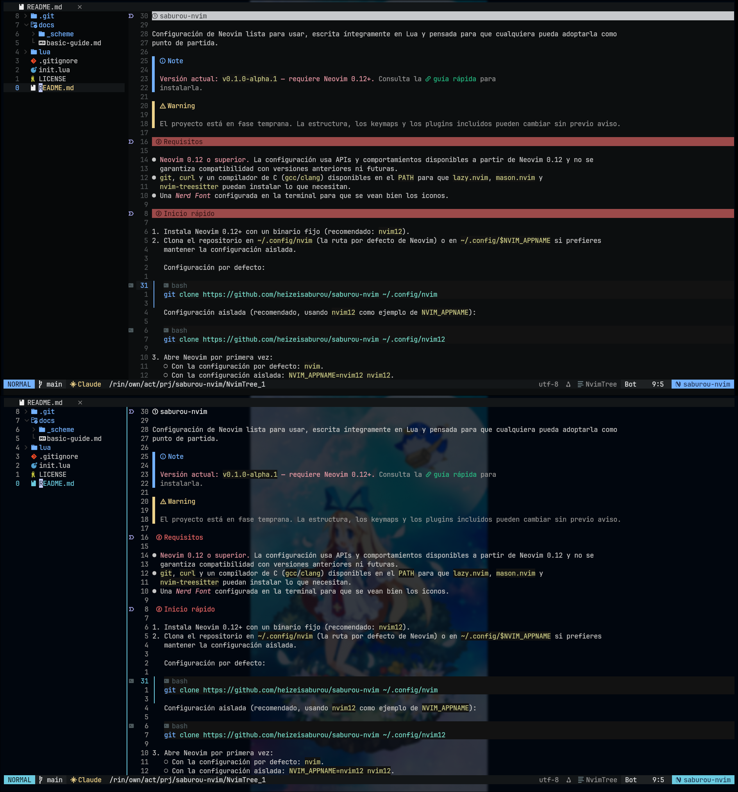

# saburou-nvim



> [!NOTE]
>
> **Versión actual: `v0.1.0-alpha.3` — requiere Neovim 0.12+.**

> 📖 Consulta la **[guía rápida](docs/basic-guide.md)** para la instalación detallada, alias recomendados y
> particularidades por sistema (Linux, macOS, Windows).

Configuración de Neovim lista para usar, escrita íntegramente en Lua y pensada para que cualquiera pueda adoptarla como
punto de partida.

> [!WARNING]
>
> El proyecto está en fase temprana. La estructura, los keymaps y los plugins incluidos pueden cambiar sin previo aviso.

> [!IMPORTANT]
>
> **`alpha.3` es probablemente una de las últimas versiones antes de una limpieza completa del proyecto.** La fase alpha
> termina aquí y, salvo parches puntuales, el siguiente paso es una versión refactorizada con un rumbo claro — lo que
> implica revisar la arquitectura, consolidar los componentes core y eliminar deuda técnica acumulada. El detalle de la
> dirección que tomará el proyecto puede consultarse en los [TODOs de saburou-nvim](docs/saburou-nvim.md#todos).

## Requisitos

### Imprescindibles

- **[Neovim](https://neovim.io/) 0.12 o superior.** La configuración usa APIs y comportamientos disponibles a partir de
  Neovim 0.12 y no se garantiza compatibilidad con versiones anteriores ni futuras.
- **[Git](https://git-scm.com/)** — necesario para clonar el repositorio y para que `lazy.nvim` instale los plugins.
- **`curl`** y un compilador de C (`gcc`/`clang`) disponibles en el `PATH` para que `lazy.nvim`, `mason.nvim` y
  `nvim-treesitter` puedan descargar y compilar lo que necesitan.
- Una _Nerd Font_ configurada en la terminal para que se vean bien los iconos.

### Recomendadas

Estas dependencias no son estrictamente obligatorias, pero las usan plugins, servidores LSP y herramientas instaladas
por Mason. Sin ellas, parte de la experiencia (búsquedas, parsers, formatters, linters, depuradores) no funcionará
correctamente.

- **[Rust](https://www.rust-lang.org/)** — necesario para compilar e instalar
- **[`tree-sitter-cli`](https://github.com/tree-sitter/tree-sitter/blob/master/crates/cli/README.md)** — herramienta de
  línea de comandos de Tree-sitter usada por `nvim-treesitter` para compilar parsers.
- **[Go](https://go.dev/)** — requerido por varios servidores LSP, formatters y linters (incluido el toolchain de Go).
- **[Python](https://www.python.org/)** — necesario para servidores LSP y herramientas externas escritas en Python, así
  como para `nvim-dap` con adaptadores Python.
- **[Node.js](https://nodejs.org/)** — usado por servidores LSP y herramientas TypeScript/JavaScript/HTML/CSS instaladas
  vía Mason, además de `copilot.lua`.
- **[ripgrep](https://github.com/BurntSushi/ripgrep)** — recomendado para que `telescope.nvim` realice búsquedas rápidas
  por contenido (`live_grep`).

## Inicio rápido

1. Instala Neovim 0.12+ con un binario fijo (recomendado: `nvim12`).
2. Clona el repositorio en `~/.config/nvim` (la ruta por defecto de Neovim) o en `~/.config/$NVIM_APPNAME` si prefieres
   mantener la configuración aislada.

   Configuración por defecto:

   ```bash
   git clone https://github.com/heizeisaburou/saburou-nvim ~/.config/nvim
   ```

   Configuración aislada (recomendado, usando `nvim12` como ejemplo de `NVIM_APPNAME`):

   ```bash
   git clone https://github.com/heizeisaburou/saburou-nvim ~/.config/nvim12
   ```

3. Abre Neovim por primera vez:
   - Con la configuración por defecto: `nvim`.
   - Con la configuración aislada: `NVIM_APPNAME=nvim12 nvim12`.

   `lazy.nvim` instalará los plugins automáticamente.

4. Ejecuta dentro de Neovim:

   ```vim
   :Lazy sync
   :MasonInstallAll
   :TSInstallAll
   ```

## Limpieza de instalaciones previas

Si vienes de una configuración diferente bajo el mismo `NVIM_APPNAME` (o si quieres empezar desde cero), conviene
eliminar los datos y el estado que pudieran haber quedado de la instalación anterior antes de abrir Neovim por primera
vez con esta configuración. Sustituye `nvim12` por el `NVIM_APPNAME` que estés usando.

Eliminar datos y estado de una instalación previa (plugins, caché, sesiones, undo, etc.):

```bash
rm -rf ~/.local/share/nvim12 ~/.local/state/nvim12
```

Eliminar la configuración en sí (el directorio donde clonaste el repositorio):

```bash
rm -rf ~/.config/nvim12
```

> [!WARNING]
>
> Estos comandos borran directorios completos. Asegúrate de que el `NVIM_APPNAME` es el correcto y de que no tienes
> trabajo sin guardar (sesiones, historial de undo, etc.) antes de ejecutarlos.

## Características

- **Tema propio:** [Moonfly](https://github.com/bluz71/vim-moonfly-colors) con personalizaciones e integraciones para
  `lualine`, `bufferline`, `nvim-tree`, `statuscol` y `render-markdown`.
- **LSP listo de fábrica** vía `nvim-lspconfig` y `mason.nvim`, con servidores preconfigurados para Lua, Python, C/C++,
  Rust, Go, TypeScript/JavaScript, HTML, CSS, Bash, CMake, Markdown, Elixir y Ansible.
- **Autocompletado** con `nvim-cmp`, `LuaSnip` y `friendly-snippets`.
- **Treesitter**, formateo con `conform.nvim` y depuración con `nvim-dap` / `nvim-dap-ui`.
- **Git integrado:** `gitsigns.nvim`, `git-conflict.nvim` y `git-blame.nvim`.
- **IA integrada:** `claude-code.nvim`, `copilot.lua` y `codex.nvim`.
- **Búsqueda y navegación:** `telescope.nvim`, `nvim-tree.lua`, `workspaces.nvim` y `mru-nav.nvim`.
- **Terminales integradas** en horizontal, vertical y flotante.
- **Sesiones persistentes** entre reinicios (estado de buffers, `nvim-tree`, `bufferline`, etc.).
- **Markdown** con renderizado en vivo mediante `render-markdown.nvim`.

## Documentación

- **[Guía rápida](docs/basic-guide.md)** — instalación aislada, uso de `NVIM_APPNAME`, alias por sistema, temas,
  integración con IA, renderizado de Markdown y manejo del clipboard y los registros de Vim.
- **[Neovim](docs/neovim.md)** — pre-requisitos, instalación por sistema y lanzadores seguros (`safe-nvim`,
  `strict-nvim`).
- **[saburou-nvim](docs/saburou-nvim.md)** — notas del proyecto, TODOs de configuración y hoja de ruta.

## Agradecimientos

Gracias a [NvChad](https://github.com/NvChad/NvChad) por haber sido durante mucho tiempo mi editor de cabecera y por
servir de base e inspiración para varias partes de esta configuración. En concreto, el directorio
`lua/hzsr/mason/nvchad/` contiene código adaptado de NvChad (consulta la sección de licencias).

## Invítame a un café

Si esta configuración te resulta útil y quieres apoyar el proyecto, puedes invitarme a un café:

[](https://www.paypal.com/donate/?hosted_button_id=W9K3ZTUM2QNAC)

Cualquier aportación es completamente voluntaria y se agradece muchísimo.

## Licencia

Este repositorio contiene código bajo varias licencias:

- La mayor parte del código original se publica bajo los términos de la [Apache License 2.0](LICENSE)
  ([texto oficial](https://www.apache.org/licenses/LICENSE-2.0)).
- El directorio [`lua/hzsr/mason/nvchad/`](lua/hzsr/mason/nvchad/) contiene código derivado de NvChad/ui y está
  licenciado bajo [GPL-3.0-only](lua/hzsr/mason/nvchad/LICENSE). Consulta también
  [`lua/hzsr/mason/nvchad/NOTICE.md`](lua/hzsr/mason/nvchad/NOTICE.md) para más detalles.
