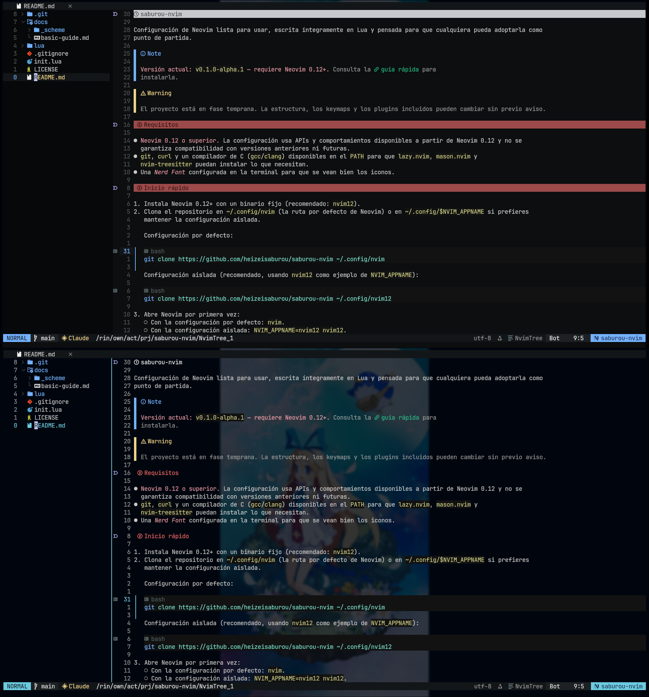
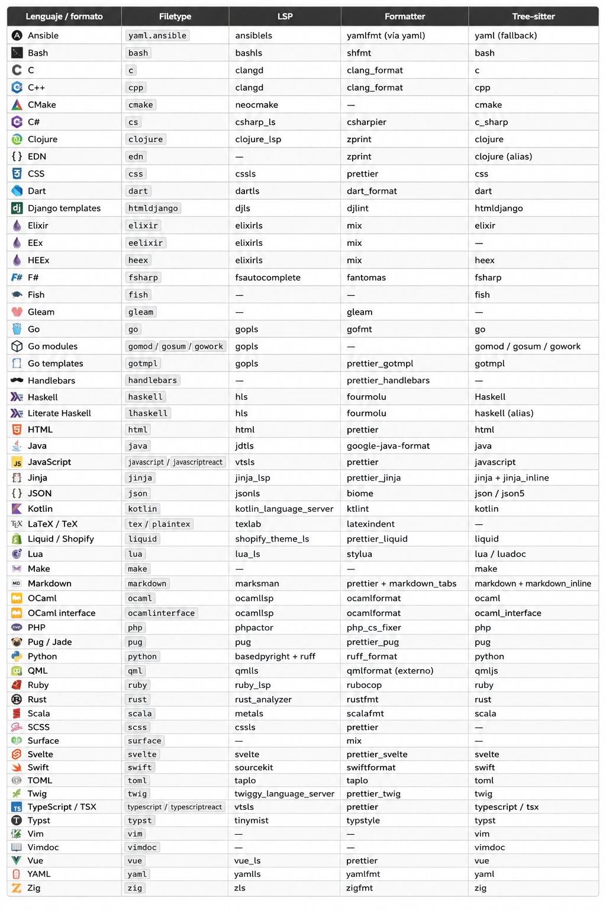

# saburou-nvim



> [!NOTE]
>
> **Versión actual: `v0.1.0-alpha.9` — requiere Neovim 0.12+.**

> 📖 Consulta la **[guía rápida](docs/basic-guide.md)** para la instalación detallada, alias
> recomendados y particularidades por sistema (Linux, macOS, Windows).

Configuración de Neovim lista para usar, escrita íntegramente en Lua y pensada para que
cualquiera pueda adoptarla como punto de partida.

> [!IMPORTANT]
>
> **`alpha.7` cierra el desarrollo funcional de esta primera alpha.**
>
> No se prevén más cambios salvo correcciones de errores o problemas de seguridad. La única
> validación importante que queda pendiente es comprobar la configuración completa en Windows 11;
> si funciona correctamente, esta versión se mantendrá tal cual mientras se prepara la siguiente
> etapa.



## Estado del proyecto

Esta alpha cumple las funcionalidades que motivaron el proyecto y seguirá disponible como una
configuración completa. También ha servido para descubrir qué partes merecen ser realmente _core_ y
dónde la flexibilidad dejó de compensar.

El intento inicial de permitir una configuración muy amplia introdujo adaptadores, casos
especiales y relaciones implícitas difíciles de entender. La persistencia durante los reinicios,
el orden de los buffers y, sobre todo, las integraciones del tema acabaron añadiéndose por capas.
Seguir ampliando esa arquitectura haría el código todavía más difícil de mantener.

La siguiente etapa partirá de una configuración limpia y contenida. No pretende portar cada
abstracción actual, sino fijar primero las decisiones invariables y reconstruir sólo el núcleo
que ha demostrado ser útil.

### Núcleo de la siguiente etapa

- **Configuración pequeña y explícita:** reducir opciones, fijar comportamientos estables y
  evitar adaptadores hasta que exista una necesidad concreta.
- **Persistencia como sistema propio:** definir qué estado se guarda, cuándo se restaura y cómo
  evoluciona su formato. El reinicio dejará de depender de parches repartidos entre buffers,
  interfaz y plugins.
- **Buffers y MRU:** controlar historial, orden, apertura, cierre y recarga desde un mismo
  modelo. Esto permitirá retirar el código específico que hoy fuerza la reordenación de
  `bufferline`.
- **Temas como parte del núcleo:** separar paleta, estado e integraciones. Cada tema declarará
  sus variantes y los componentes que soporta, sin mezclar esa lógica con la configuración
  funcional de cada plugin.
- **Un plugin por archivo:** eliminar `lua/lzy/plg.lua` y colocar la especificación, carga y
  configuración de cada plugin en una unidad fácil de localizar.
- **LSP, formatters e indentación:** definir claramente qué responsabilidad pertenece a Neovim,
  Mason, el servidor LSP y Conform. La política por lenguaje sustituirá la configuración de
  indentación actual, que resulta costosa de ampliar y mantener.
- **Pruebas del comportamiento del core:** cubrir persistencia, transiciones de buffers, rutas y
  procesos por sistema operativo. Un formato de estado versionado permitirá detectar
  incompatibilidades en vez de restaurar datos antiguos a ciegas.

Plugins, keymaps y detalles visuales deberán consumir estos sistemas; no definir su arquitectura.
La hoja de ruta más detallada está en las [notas de saburou-nvim](docs/saburou-nvim.md).

## Requisitos

### Imprescindibles

- **[Neovim](https://neovim.io/) 0.12+** La configuración usa APIs y comportamientos disponibles
  a partir de Neovim 0.12. No se garantiza compatibilidad con versiones anteriores ni futuras.
- **[Git](https://git-scm.com/)** — necesario para clonar el repositorio y para que `lazy.nvim`
  instale los plugins.
- **[Cargo](https://doc.rust-lang.org/cargo/getting-started/installation.html)** — necesario para
  compilar e instalar `tree-sitter-cli`.
- **[Node.js](https://nodejs.org/)** — necesario para compilar `tree-sitter-cli` y para varias
  herramientas de JavaScript/TypeScript usadas por la configuración, incluidos servidores LSP,
  herramientas instaladas mediante Mason y `copilot.lua`.
- **`curl`** y un compilador de C (`gcc` o `clang`) disponibles en el `PATH` — necesarios para
  que `lazy.nvim`, `mason.nvim` y `nvim-treesitter` puedan descargar y compilar dependencias.
- **[`tree-sitter-cli`](https://github.com/tree-sitter/tree-sitter/blob/master/crates/cli/README.md)
  0.26.1 o superior** — necesario para que `nvim-treesitter` compile los parsers.
- Una **Nerd Font** configurada en la terminal para mostrar correctamente los iconos.

### Recomendadas

Estas dependencias no son estrictamente obligatorias, pero las usan plugins, servidores LSP y
herramientas instaladas por Mason. Sin ellas, parte de la experiencia (búsquedas, parsers,
formatters, linters, depuradores) no funcionará correctamente.

- **[Go](https://go.dev/)** — requerido por varios servidores LSP, formatters y linters (incluido
  el toolchain de Go).
- **[Python](https://www.python.org/)** — necesario para servidores LSP y herramientas externas
  escritas en Python, así como para `nvim-dap` con adaptadores Python.
- **[ripgrep](https://github.com/BurntSushi/ripgrep)** — recomendado para que `telescope.nvim`
  realice búsquedas rápidas por contenido (`live_grep`).

## Inicio rápido

### Windows (PowerShell)

La instalación aislada bajo el nombre `srnv` evita mezclar esta configuración, sus plugins y su
estado con otra instalación de Neovim.

1. Instala los [requisitos](#requisitos), abre PowerShell y clona el repositorio en la ruta que
   Neovim asocia con `NVIM_APPNAME=srnv`:

   ```powershell
   git clone https://github.com/heizeisaburou/saburou-nvim "$env:LOCALAPPDATA\srnv"
   ```

2. Para iniciarlo durante la sesión actual de PowerShell:

   ```powershell
   $env:NVIM_APPNAME = "srnv"
   nvim
   ```

   La misma operación en una sola línea:

   ```powershell
   $env:NVIM_APPNAME="srnv"; nvim
   ```

3. Para disponer del comando `srnv` en todas las sesiones sin dejar modificado
   `NVIM_APPNAME`, crea el perfil si todavía no existe y ábrelo:

   ```powershell
   New-Item -ItemType Directory -Path (Split-Path $PROFILE) -Force | Out-Null
   New-Item -ItemType File -Path $PROFILE -Force | Out-Null
   notepad $PROFILE
   ```

   Añade esta función al perfil:

   ```powershell
   function srnv {
       $hadNvimAppName = Test-Path Env:NVIM_APPNAME
       $oldNvimAppName = $env:NVIM_APPNAME

       try {
           $env:NVIM_APPNAME = "srnv"
           nvim @args
       }
       finally {
           if ($hadNvimAppName) {
               $env:NVIM_APPNAME = $oldNvimAppName
           }
           else {
               Remove-Item Env:NVIM_APPNAME -ErrorAction SilentlyContinue
           }
       }
   }
   ```

   Guarda el archivo y ejecuta `. $PROFILE` para cargarlo sin reiniciar PowerShell. A partir de
   entonces puedes ejecutar `srnv` o pasarle argumentos, por ejemplo `srnv README.md`. La función
   restaura el valor anterior de `NVIM_APPNAME` al cerrar Neovim, incluso si la ejecución termina
   con un error.

#### Shell de la terminal integrada

Las terminales horizontal, vertical y flotante eligen su shell de Windows mediante
[`lua/user/terminal.lua`](lua/user/terminal.lua):

```lua
return {
  windows_shell = "auto",
}
```

Los valores admitidos son:

- `"auto"` (predeterminado): prueba PowerShell 7 (`pwsh`), Windows PowerShell 5.1
  (`powershell`) y `cmd.exe`, en ese orden.
- `"pwsh"`: solicita PowerShell 7 explícitamente.
- `"powershell"`: solicita Windows PowerShell 5.1 explícitamente.
- `"cmd"`: utiliza siempre `cmd.exe`.

PowerShell 7 es opcional y puede instalarse desde PowerShell o `cmd.exe` con:

```powershell
winget install --id Microsoft.PowerShell --source winget
```

Si una preferencia explícita no está instalada, se muestra un aviso y se utiliza `cmd.exe` para
que la terminal siga funcionando. La selección automática prioriza la versión moderna, conserva
Windows PowerShell 5.1 como fallback disponible de fábrica y sólo termina en `cmd.exe` si no
encuentra ninguna de las dos. `:TerminalInfo` muestra la preferencia, la shell resuelta y el
ejecutable usado.

Esta selección sólo afecta a las terminales integradas. No cambia `vim.o.shell`, por lo que
comandos como `:!` y `:make` conservan la shell configurada por Neovim.

### Linux y macOS

1. Instala Neovim 0.12+ con un binario fijo (recomendado: `nvim12`).
2. Clona el repositorio en `~/.config/nvim` (la ruta por defecto de Neovim) o en
   `~/.config/$NVIM_APPNAME` si prefieres mantener la configuración aislada.

   Configuración por defecto:

   ```bash
   git clone https://github.com/heizeisaburou/saburou-nvim ~/.config/nvim
   ```

   Configuración aislada (recomendado, usando `nvim12` como ejemplo de `NVIM_APPNAME`):

   ```bash
   git clone https://github.com/heizeisaburou/saburou-nvim ~/.config/nvim12
   ```

3. Abre Neovim por primera vez:

   - Con la configuración por defecto: `nvim`.
   - Con la configuración aislada: `NVIM_APPNAME=nvim12 nvim12`.

### Primer inicio

`lazy.nvim` instalará los plugins automáticamente. Después, ejecuta dentro de Neovim:

```vim
:Lazy sync
:MasonInstallAll
:TSInstallAll
```

En Windows, `TSInstallAll` comprueba primero una de las descargas exactas de los parsers. Si
Schannel devuelve `CRYPT_E_NO_REVOCATION_CHECK`, ofrece reintentar interactivamente con
`--ssl-revoke-best-effort`. La excepción solo se aplica a los archivos de parsers fijados por
commit durante esa ejecución: no modifica `.curlrc`, no desactiva la validación del certificado y
cualquier otro error de TLS detiene la instalación.

### Configuración de LuaLS

Esta configuración incluye el comando `:Luarc [NVIM_APPNAME]`, que genera en un buffer el
`.luarc.json` correspondiente a la instalación actual (o al `NVIM_APPNAME` indicado). Guarda el
buffer para escribir el archivo:

```vim
:Luarc
:write!
```

El archivo generado activa `runtime.pathStrict`. Sin esta opción, LuaLS busca los módulos de
`require` recursivamente por nombre de archivo: por ejemplo, `require "snacks"` también puede
asociarse por error con cualquier `**/snacks.lua` del workspace, aunque pertenezca a otro
namespace. La búsqueda estricta respeta las raíces Lua configuradas y evita estas colisiones, por
lo que no es necesario prefijar archivos como `l_snacks.lua` únicamente para distinguirlos del
plugin `snacks`.

## Limpieza de instalaciones previas

Si vienes de una configuración diferente bajo el mismo `NVIM_APPNAME` (o si quieres empezar desde
cero), conviene eliminar los datos y el estado que pudieran haber quedado de la instalación
anterior antes de abrir Neovim por primera vez con esta configuración. Sustituye `nvim12` por el
`NVIM_APPNAME` que estés usando.

Eliminar datos y estado de una instalación previa (plugins, caché, sesiones, undo, etc.):

```bash
rm -rf ~/.local/share/nvim12 ~/.local/state/nvim12
```

Eliminar la configuración en sí (el directorio donde clonaste el repositorio):

```bash
rm -rf ~/.config/nvim12
```

> [!WARNING]
>
> Estos comandos borran directorios completos. Asegúrate de que el `NVIM_APPNAME` es el correcto
> y de que no tienes trabajo sin guardar (sesiones, historial de undo, etc.) antes de
> ejecutarlos.

## Características

- **Tema propio:** [Moonfly](https://github.com/bluz71/vim-moonfly-colors) con personalizaciones
  e integraciones para `lualine`, `bufferline`, `nvim-tree`, `statuscol` y `render-markdown`.
- **LSP listo de fábrica** vía `nvim-lspconfig` y `mason.nvim`, con servidores preconfigurados
  para Lua, Python, C/C++, Rust, Go, TypeScript/JavaScript, HTML, CSS, Bash, CMake, Markdown,
  Elixir y Ansible.
- **Autocompletado** con `nvim-cmp`, `LuaSnip` y `friendly-snippets`.
- **Treesitter**, formateo con `conform.nvim` y depuración con `nvim-dap` / `nvim-dap-ui`.
- **Git integrado:** `gitsigns.nvim`, `diffview.nvim` y `git-blame.nvim`.
- **IA integrada:** `claude-code.nvim`, `copilot.lua` y `codex.nvim`.
- **Búsqueda y navegación:** `telescope.nvim`, `nvim-tree.lua`, `workspaces.nvim` y
  `mru-nav.nvim`.
- **Terminales integradas** en horizontal, vertical y flotante.
- **Reinicio controlado** que intenta conservar el estado temporal de buffers, `nvim-tree` y
  `bufferline`.
- **Markdown** con renderizado en vivo mediante `render-markdown.nvim`.

## Indentación por lenguaje

La política de indentación se define en [`lua/user/indent.lua`](lua/user/indent.lua). La configuración base usa dos
espacios y permite sobrescribir el estilo y el ancho de cualquier `filetype`:

```lua
return {
  default = {
	style = "spaces",
	width = 2,
  },

  filetypes = {
	markdown = {
	  style = "tabs",
	  width = 4,
	},
  },
}
```

Neovim aplica esta política mediante opciones locales de buffer (`expandtab`, `shiftwidth`, `tabstop` y
`softtabstop`). Conform consulta la misma fuente al ejecutar los formateadores compatibles, por lo
que escribir y formatear mantienen el mismo criterio. Los formateadores que imponen un estilo
propio por diseño, como `gofmt`, pueden conservar sus reglas.

Markdown utiliza tabs reales de cuatro columnas para mantener el mismo comportamiento que
Obsidian y CommonMark. Prettier recibe `useTabs` y, como su printer de Markdown todavía genera
espacios en parte de la estructura, una segunda pasada interna normaliza únicamente la sangría
inicial sin modificar el contenido.

La configuración puede sobrescribirse temporalmente sin editar archivos:

```vim
:IndentSet tabs 4 markdown
:IndentSet spaces 2 lua
:IndentReset markdown
:IndentReset!
```

También está disponible desde Lua:

```lua
sabunv.indent.set("markdown", { style = "tabs", width = 4 })
sabunv.indent.reset("markdown")
```

Los overrides se aplican inmediatamente a todos los buffers abiertos del `filetype`, afectan a las
siguientes ejecuciones de Conform y sobreviven tanto a una recarga con `:source` como a los
reinicios realizados por la configuración. Siguen siendo temporales: tras cerrar Neovim
normalmente no sustituyen la configuración declarada en `lua/user/indent.lua`.

## Formateo manual

`Alt+F` formatea el buffer actual con Conform; `<leader>fm` hace lo mismo y también permite formatear
una selección visual. Cada ejecución informa si aplicó cambios, si no produjo cambios —porque el
contenido ya estaba formateado o lo excluye `.prettierignore`— o si ocurrió un error. El error
concreto se muestra en la notificación y `:ConformInfo` permite consultar los formateadores
disponibles y el log de depuración.

Prettier 3 usa por defecto tanto `.gitignore` como `.prettierignore`. Esta configuración distingue
sus propósitos para el formateo manual: un archivo excluido de Git continúa siendo formateable,
mientras que el `.prettierignore` más cercano sí se respeta. Así, directorios de notas o
referencias como `.reference` pueden permanecer fuera del repositorio sin convertir silenciosamente
`Alt+F` en una operación vacía. Si un proyecto necesita impedir que Prettier toque un archivo, debe
declararlo en `.prettierignore`.

## Documentación

- **[Guía rápida](docs/basic-guide.md)** — instalación aislada, uso de `NVIM_APPNAME`, alias por
  sistema, temas, integración con IA, renderizado de Markdown y manejo del clipboard y los
  registros de Vim.
- **[Neovim](docs/neovim.md)** — pre-requisitos, instalación por sistema y lanzadores seguros
  (`safe-nvim`, `strict-nvim`).
- **[saburou-nvim](docs/saburou-nvim.md)** — notas del proyecto, TODOs de configuración y hoja de
  ruta.

## Agradecimientos

Gracias a [NvChad](https://github.com/NvChad/NvChad) por haber sido durante mucho tiempo mi editor de cabecera y por servir de base e
inspiración para varias partes de esta configuración. En concreto, el directorio
`lua/hzsr/mason/nvchad/` contiene código adaptado de NvChad (consulta la sección de licencias).

## Invítame a un café

Si esta configuración te resulta útil y quieres apoyar el proyecto, puedes invitarme a un café:

[](https://www.paypal.com/donate/?hosted_button_id=W9K3ZTUM2QNAC)

Cualquier aportación es completamente voluntaria y se agradece muchísimo.

## Licencia

Este repositorio contiene código bajo varias licencias:

- La mayor parte del código original se publica bajo los términos de la
  [Apache License 2.0](LICENSE) ([texto oficial](https://www.apache.org/licenses/LICENSE-2.0)).
- El directorio [`lua/hzsr/mason/nvchad/`](./lua/hzsr/mason/nvchad/) contiene código derivado de
  NvChad/ui y está licenciado bajo [GPL-3.0-only](./lua/hzsr/mason/nvchad/LICENSE). Consulta
  también [`lua/hzsr/mason/nvchad/NOTICE.md`](./lua/hzsr/mason/nvchad/NOTICE.md) para más
  detalles.
